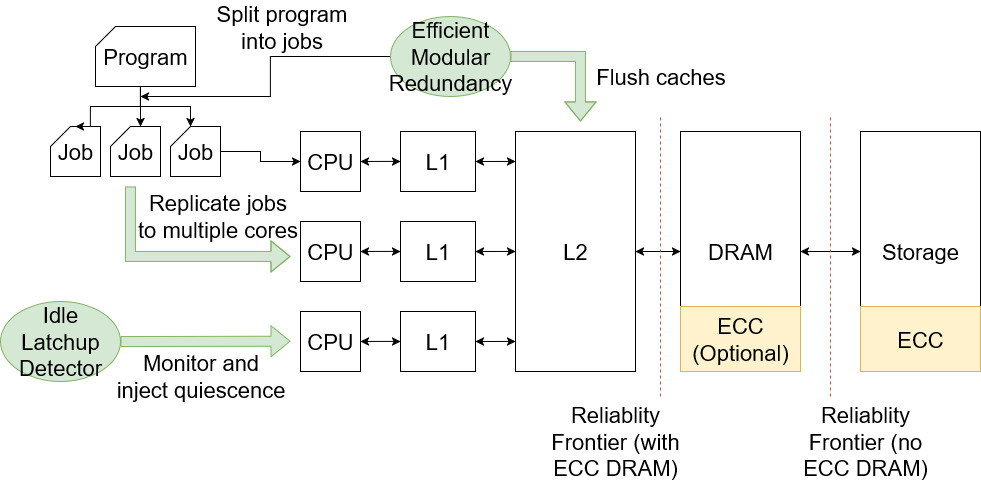

To address the risk of SEUs onboard spacecraft, EMR is a runtime and programming model for applications written in C++, which automatically manages and optimizes TMR and checkpointing.
EMR is suitable for most workloads run on spacecraft, such as encryption or image processing, that  run the same computation across different subsets of a dataset.
By taking advantage of this property, we can efficiently parallelize the replication of all non-ECC components while relying on the hardware ECC of components such as RAM and storage.
EMR automatically inserts cache clears and schedules subcomputations to minimize the runtime of cache clears needed to ensure that potentially corrupted data is only read into at most one executor.

[Check out the code here!](https://github.com/radshield/dtss)



# Requirements
* Boost 1.45
* Clang 8 or higher
* CMake 3.18 or higher
* Ninja 1.11.0 or higher

# Build instructions
* Run `make build` in the root directory of the repo, which will automatically run CMake and Ninja
* Output files will be in the `build/` subdirectory

For ease of use, a Docker image with all dependencies preinstalled is also available. The image can be built with:

```bash
make docker```

A container can be started that maps the repository to `/mnt` using:

```bash
make docker-shell```

# Usage

```c++
typedef pair<size_t, void *> DTSSInput;
struct InputData {
  vector<DTSSInput> inputs;
  DTSSInput output;
  bool operator==(InputData& b);
};

dtss_compute(unordered_set<InputData *> dataset,
             void (*processor)(InputData *));
```
