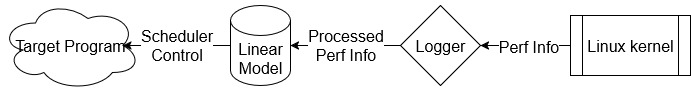

ILD detects latchups using current draw and OS performance counters, and triggers reboots when an SEL is detected.
It was tested on a Raspberry Pi, and assumes a INA3221 chip connected to the Raspberry Pi through I2C0 on the GPIO connector.



ILD's key idea is that while CPU current draw can vary wildly during compute, it is roughly stable when no programs are actively running.
By training a model of pre-latchup quiescent state, we can then compare it to the current state to check if small increases in current can be seen.
By running a median filter over the last 3 seconds of observation, we can clear out transient current spikes from system maintainence activities such as logging.

[Check out the code here!](https://github.com/radshield/raspi-sel/)

## Requirements

* Python 3.9 or higher with pip and CPython support
* virtualenv to keep dependencies separate (optional)
* CMake
* Linux with perf and cpufreq support
* INA3221 connected to the Raspberry Pi through GPIO

## Setup
```bash
# Install dependencies
sudo apt-get install -y libcpupower-dev linux-perf libboost-dev libi2c-dev
sudo apt-get install -y ninja-build cmake clang

# Build recording tool
mkdir build && cd build
CC=clang CXX=clang++ cmake -G Ninja -DCMAKE_EXPORT_COMPILE_COMMANDS=ON -DCMAKE_BUILD_TYPE=RelWithDebInfo ..
ninja
```

## Usage

A model will first need to be built. This can be done with the included Python
scripts.
Once complete, the prototye can be run from the root directory of the project as
so:

```bash
./build/seelie model_to_use
```
