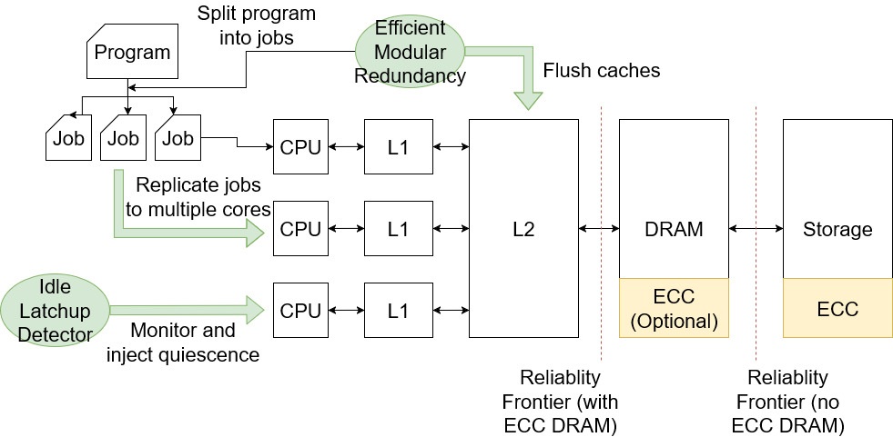

Radshield is a set of two software systems that protect against the two most prevalent single-event effects facing spacecraft operators today: single-event latchups and single-event upsets.
Our system increases the reliability of commodity hardware and enables them to act as reliable flight computers or co-processors on spacecraft.
This system is tested in real-world systems, from commodity SmallSats to a commodity compute element onboard the Perseverance Mars rover.

> The 9000 series is the most reliable computer ever made. No 9000 computer has ever made a mistake or distorted information. We are all, by any practical definition of the words, foolproof and incapable of error.

*- HAL, 2001: A Space Odyssey*

##### Hold up, radiation errors?

Yes! On Earth, we're protected by the Earth's magnetic field and atmosphere, which deflects or absorbs most of the ionizing radiation from the sun.
However, spacecraft in orbit or deep space don't have the same protections, and are exposed to heavy amounts of ionizing radiation, which can cause all sorts of nasty errors on the satellites.
We call transient errors that cause the computer to misbehave *single-event effects*.

#### Single-Event Upsets

The most common single-event effect we see in space are *single-event upsets* (SEUs), which are essentially radiation-induced bit-flips in memory, cache, or the compute pipelines.
[Efficient Modular Redundancy](emr) (EMR) addresses this problem by automatically replicating non-ECC-protected actions and intelligently scheduling the replicated compute to minimize the runtime.
In our tests with real-world use cases including encryption, data compression, and global localization, EMR is 1.4 - 35.5x more efficient than state-of-the-art triple modular redundancy.

#### Single-Event Latchups

The residual charge left by radiation particles can change transistor structures and cause a localized short-circuit known as *single-event latchups* (SELs).
This causes the short-circuited area to generate a ton of heat, and cause a slight increase in current draw by the affected IC.
And in space, you don't have an atmosphere for the heat to dissipate into, so the heat eventually overheats and destroys the chip.
Fortunately, as long as we can detect these latch-ups, we can simply power cycle the affected chip before it burns out.
This draws out the residual charge that caused the latchup in the first place, and the chip will work like normal again.

To address the renewed threat of micro-SELs of <1A on modern process nodes, we developed [Idle Latchup Detector](ild) (ILD), a high-fidelity detector for SEL events.
Since micro-SELs trigger very small changes in the system's current draw, the only reliable time to observe the current draw change is when the system is idle.
ILD uses OS-visible performance counters to automatically determine when the system is naturally idle, and uses a lightweight ML model to check if current draw is within nominal bounds.
In our testing, ILD has a 0.02% false positive rate, and a 0% false negative rate.

